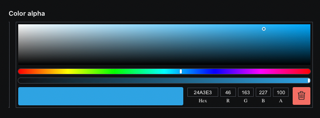

# @sanity/color-input

> **NOTE** 
> 
> This is the **Sanity Studio v3 version** of @sanity/color-input.
> 
> For the v2 version, please refer to the [v2-branch](https://github.com/sanity-io/sanity/tree/next/packages/%40sanity/color-input).

## What is it?

Color input plugin for [Sanity](https://sanity.io/) that stores selected colors in hex, hsl, hsv and rgb format.



## Installation
```
npm install --save @sanity/color-input@studio-v3
```

or 

```
yarn add @sanity/color-input@studio-v3
```

## Usage

Add it as a plugin in sanity.config.ts (or .js):

```js
import { colorSchema } from "@sanity/color-input";

export default createConfig({
  // ...
  plugins: [
    colorSchema(),
  ] 
})
```


Now you can use the `color` type in your schema types:

```js
// [...]
{
  fields: [
    // [...]
    {
      name: 'favoriteColor',
      title: 'Favorite color',
      type: 'color'
    }
  ]
}
```

## Options

To disable the alpha option, set `disableAlpha` to `true`:

```js
// ...fields...
{
  name: 'favoriteColor',
  title: 'Color no-alpha',
  type: 'color',
  options: {
    disableAlpha: true
  }
}
```

Which will render accordingly:


## Data model

```js
{
  _type: 'color',
  hex: '#29158a',
  alpha: 0.9,
  hsl: {
    _type: 'hslaColor',
    h: 249.99999999999994,
    s: 0.7328000000000001,
    l: 0.313,
    a: 0.9
  },
  hsv: {
    _type: 'hsvaColor',
    h: 249.99999999999994,
    s: 0.8457987072945522,
    v: 0.5423664,
    a: 0.9
  },
  rgb: {
    _type: 'rgbaColor',
    r: 41
    g: 21,
    b: 138,
    a: 0.9
  }
}
```

## License

MIT-licensed. See LICENSE.


## Develop & test

Make sure to run `npm run build` once, then run

```bash
npm run link-watch
```

In another shell, `cd` to your test studio and run:

```bash
npx yalc add @sanity/color-input --link && yarn install
```

Now, changes in this repo will be automatically built and pushed to the studio,
triggering hotreload. Yalc avoids issues with react-hooks that are typical when using yarn/npm link.

### About build & watch 

This plugin uses [@sanity/plugin-sdk](https://github.com/sanity-io/plugin-sdk)
with default configuration for build & watch scripts.